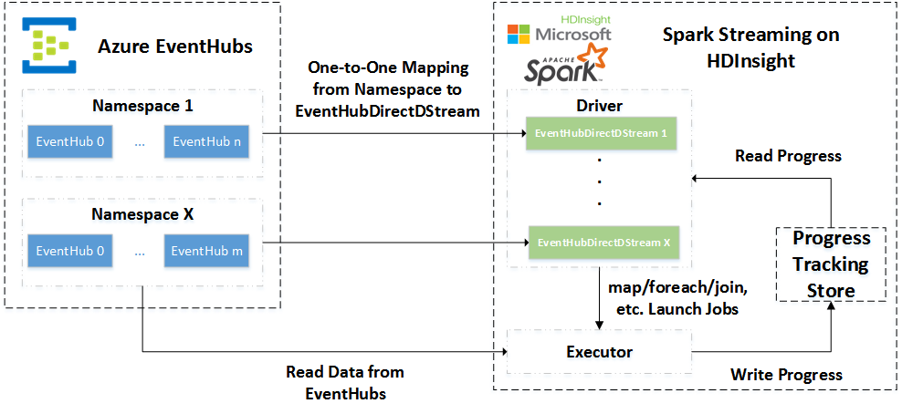

# spark-eventhubs [](https://travis-ci.org/hdinsight/spark-eventhubs)
This is the source code of EventHubsReceiver for Spark Streaming.

[Here](https://github.com/hdinsight/spark-eventhubs/tree/master/examples) is the examples that use this library to process streaming data from Azure Eventhubs.

For latest integration of EventHubs and Spark Streaming, the document can be found [here](docs/direct_stream.md).

## Latest Release: 2.0.4

[Change Log](doc/change_log.md)

## Usage

### Getting Officially Released Version

We will have the official release in the maven central repo, you can add the following dependency to your project to reference Spark-EventHubs

#### Maven Dependency
    <!-- https://mvnrepository.com/artifact/com.microsoft.azure/spark-streaming-eventhubs_2.11 -->
    <dependency>
        <groupId>com.microsoft.azure</groupId>
        <artifactId>spark-streaming-eventhubs_2.11</artifactId>
        <version>2.0.3</version>
    </dependency>

#### SBT Dependency
    // https://mvnrepository.com/artifact/com.microsoft.azure/spark-streaming-eventhubs_2.11
    libraryDependencies += "com.microsoft.azure" % "spark-streaming-eventhubs_2.11" % "2.0.3"

#### Maven Central for other dependency co-ordinates

https://mvnrepository.com/artifact/com.microsoft.azure/spark-streaming-eventhubs_2.11/2.0.3

### Getting Staging Version

We will also publish the staging version of Spark-EventHubs in GitHub. To use the staging version of Spark-EventHubs, the first step is to indicate GitHub as the source repo by adding the following entry to pom.xml:

```xml
<repository>
      <id>spark-eventhubs</id>
      <url>https://raw.github.com/hdinsight/spark-eventhubs/maven-repo/</url>
      <snapshots>
        <enabled>true</enabled>
        <updatePolicy>always</updatePolicy>
      </snapshots>
</repository>
```

You can then add the following dependency to your project to take the pre-released version.

#### Maven Dependency
    <!-- https://mvnrepository.com/artifact/com.microsoft.azure/spark-streaming-eventhubs_2.11 -->
    <dependency>
        <groupId>com.microsoft.azure</groupId>
        <artifactId>spark-streaming-eventhubs_2.11</artifactId>
        <version>2.0.3</version>
    </dependency>

#### SBT Dependency
    // https://mvnrepository.com/artifact/com.microsoft.azure/spark-streaming-eventhubs_2.11
    libraryDependencies += "com.microsoft.azure" % "spark-streaming-eventhubs_2.11" % "2.0.3"

## Build Prerequisites

In order to build and run the examples, you need to have:

1. Java 1.8 SDK.
2. Maven 3.x
3. Scala 2.11

## Build Command
    mvn clean
    mvn package
This command builds and installs EventHubsReceiver jar to local maven cache. Subsequently you can build any Spark Streaming application that references this jar.

## Integrate Spark Streaming and EventHubs with Direct DStream

In the latest version of Spark-EventHubs, we provide a brand-new approach to integrate Spark Streaming and EventHubs. Being different with the previous approach (Receiver-based), we directly fetch events from EventHubs in distributed Spark tasks which execute the user-defined functions instead of starting a dedicated Spark job to start receiver threads. We call this new approach `Direct DStream` as it is inspired by [the community effort on integrating Spark Streaming and Kafka](https://github.com/apache/spark/tree/master/external/kafka-0-10).

### Overview of Direct DStream

The following figure shows the architecture of workflow of Direct-DStream-based Integration of Spark Streaming and EventHubs. .

EventHubDirectDStream is a new type of input stream, which is one-one mapping with a EventHubs namespace and the partitions of the RDD generated in EventHubDirectDStream is one-one mapping to the EventHub partition.

For example, if the user has two namespaces of EventHubs, say `"namespace1"` and `"namespace2"`, each of which contains 2 EventHub instances, "eh1" and "eh2". Both of "eh1" and "eh2" contains 32 partitions. In this scenario, the user will create two EventHubDirectDStream instances with the APIs we will introduce later. The RDDs generated within these EventHubDirectStream will contain 64 partitions each of which maps to partition 0 - 31 of "eh1" and "eh2".

We also provide a progress tracking store component in our implementation. Progress Tracking Store tracks the highest offset processed in each EventHub partition. With this component, users can start from the last saved offset even they update the application code, which is not able to be achieved with the normal Spark checkpoints.

### How We Use It

The new API is simple to use. In the following code snippet, we create a EventHubDirectDStream.

```scala
val inputDirectStream = EventHubsUtils.createDirectStreams(ssc, "namespace1",
      progressDir, Map(eventHubName -> eventhubParameters))
```

`ssc` is an created StreamingContext object; `"namespace1"` is the namespace of the EventHub you would like to handle with this EventHubDirectDStream; `progressDir` specifies the progress file directory this EventHubDirectDStream works with, and a new directory with the same name as your application will be created under the specified path. The last parameter is a Map from `EventHubName` to `Configuration Entries`, where `Configuration Entries` is also a map. We support the following configuration entries:

* "eventhubs.policyname"
* "eventhubs.policykey"
* "eventhubs.namespace"
* "eventhubs.name"
* "eventhubs.partition.count"
* "eventhubs.consumergroup"
* "eventhubs.maxRate"

While the names of the configuration entries are self-explainable, we would highlight the additional `eventhubs.maxRate`. This parameter regulates the maximum number of messages being processed in a single batch for every EventHub partition and it effectively prevent the job being hold due to the large number of messages being fetched at once.

After getting a EventHubDirectDStream instance, you can apply whatever operation which are available to a ordinary DStream instance with it. We have several examples applications in our [example code base](https://github.com/hdinsight/spark-streaming-data-persistence-examples)

### Future Directions

We will continuously improve the stability and performance of EventHub integration. Some of the improvements are as following:

* We will work with EventHub teams to develop the more performant progress tracking approach with the coordination from EventHub server side.
* We will deliver implementation of design patterns like Lambda/Kappa/Liquid, etc, based on Spark Streaming and EventHub
* We will include the integration with Structured Streaming in the next release
