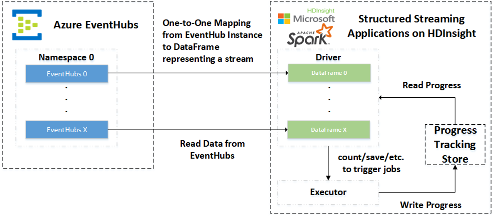

## Streaming Analytics for Structured Data with Spark and Azure Event Hubs

With the latest release of spark-eventhubs, users can analyze real-time data ingested by Azure Event Hubs with Spark's Structured Streaming engine.

[Structured Streaming](http://spark.apache.org/docs/latest/structured-streaming-programming-guide.html) is a new streaming procecessing engine built on top of Spark SQL. With Structured Streaming, users can describe the computation in the same way as with Spark SQL. Structured Streaming internals applies the user-defined computation over the continuously arriving data and update the data analytic results to deliver.

### Overview of Structured Streaming

The following figure shows the workflow of Spark Structured Streaming Connector for Event Hubs. .

Structured Streaming also follows `micro-batch` model. It periodically fetches data from the data source and uses a DataFrame to represent the fetched data for a certain batch. In Spark Structured Streaming Connector for Event Hubs, we use a DataFrame to represent the data fetched from a `single Event Hubs instance` for a certain batch. (If you are a user of Direct DStream-based Spark Streaming connector, note that this abstraction level is a bit different with Direct DStream design)

For example, if the user has two Event Hubs instances, say `eh1` and `eh2`, and both of `eh1` and `eh2` contains 32 partitions. In this scenario, the user will create two DataFrames with the APIs we will introduce later. The DataFrames contain 32 partitions each of which maps to partition 0 - 31 of "eh1" and "eh2".

### How We Use It

#### Establishing the Connection with Azure Event Hubs

The new API is simple to use. In the following code snippet, we establish a connection between Structured Streaming and Azure Event Hubs.

```scala
val eventhubParameters = Map[String, String](
  "eventhubs.policyname" -> policyName,
  "eventhubs.policykey" -> policyKey,
  "eventhubs.namespace" -> eventHubNamespace,
  "eventhubs.name" -> eventHubName,
  "eventhubs.partition.count" -> "32",
  "eventhubs.consumergroup" -> "$Default",
  "eventhubs.progressTrackingDir" -> progressDir,
  "eventhubs.maxRate" -> s"$maxRate",
  "eventhubs.sql.containsProperties" -> "true",
  "eventhubs.sql.userDefinedKeys" -> "creationTime,randomUserProperty"
)

val spark = SparkSession.builder.getOrCreate
val inputStream = spark.readStream.
  format("eventhubs").
  options(eventhubParameters).
  load

// Describe your streaming computation using Dataset API
// Use inputStream as if it was a regular Dataset

import org.apache.spark.sql.streaming.{OutputMode, Trigger}
import scala.concurrent.duration._
val streamingQuery = inputStream.writeStream.
  format("parquet").
  outputMode(OutputMode.Append).
  trigger(Trigger.ProcessingTime(10 seconds)).
  option("checkpointLocation", checkpointLocation).
  option("path", outputPath + "/ETL").
  partitionBy("creationTime").
  start

streamingQuery.awaitTermination()
```

`spark` is a [SparkSession](http://spark.apache.org/docs/latest/api/scala/index.html#org.apache.spark.sql.SparkSession) object which is required in every Spark SQL application (as of Spark 2.0.0). In `eventhubParameters`, we specify the parameters required for Event Hubs connection, e.g. `policyName`, `policyKey`, `consumergroup`, etc. To establish the connection, users only need to specify the stream format as `"eventhubs"`, e.g.

```scala
val inputStream = spark.readStream.
  format("eventhubs"). // <-- specifying Event Hubs as the input data source
  options(eventhubParameters).
  load
```
  
The following steps are exactly the same with other Structured Streaming applications, like set `outputMode`, `trigger` and specify output data sink (to write the results of a streaming query to).

#### Building Schema of Messages

In the above example, we have two additional parameters, `eventhubs.sql.containsProperties` and `eventhubs.sql.userDefinedKeys`, which are the key factors to transform the messages to the structured representation in Spark SQL, i.e. DataFrame.

In Event Hubs Client, users can serialize data in the `body` of EventData and additionally pack in some properties with application properties (more details see [Event Hubs Java Client](https://github.com/Azure/azure-event-hubs-java). ApplicationProperties is essentially a HashMap which types key as string and value as `java.lang.Object`.

This feature is very useful when the user needs to mark the message with customized properties, e.g. the generated timestamp of the event. Transforming the user-added properties to the columns in DataFrame will facilitate the usage of Structured Streaming features, e.g. `windowing`, `groupBy`, and `watermarks`. [More Details](http://spark.apache.org/docs/latest/structured-streaming-programming-guide.html#operations-on-streaming-dataframesdatasets)

The users of our structured streaming connector have two ways to transform the key-value pairs in ApplicationProperties to columns in DataFrame:

Suppose we defined properties in the message sent to eventhubs, `creationTime` and `otherUserDefinedKey`.

##### Approach 1: set `eventhubs.sql.containsProperties` to true

By only setting `eventhubs.sql.containsProperties` to true, all properties in ApplicationProperties will be converted to a column in the resulting DataFrame typed as Map[String, String]. The DataFrame got with `sparkSession.readStream.format("eventhubs").options(eventhubParameters)
  .load()` looks like:
  
  ```
  +-------+------+---------+------------+--------------------+------------+--------------------+
|   body|offset|seqNumber|enqueuedTime|           publisher|partitionKey|          properties|
+-------+------+---------+------------+--------------------+------------+--------------------+
|   [31]|     0|        0|           0|Microsoft Corpora...|           0|Map(otherUserDefi...|
|   [35]|     1|        1|        1000|Microsoft Corpora...|           0|Map(otherUserDefi...|
|   [39]|     2|        2|        2000|Microsoft Corpora...|           0|Map(otherUserDefi...|
|   [33]|     0|        0|           0|Microsoft Corpora...|           1|Map(otherUserDefi...|
|   [37]|     1|        1|        1000|Microsoft Corpora...|           1|Map(otherUserDefi...|
|[31 31]|     2|        2|        2000|Microsoft Corpora...|           1|Map(otherUserDefi...|
+-------+------+---------+------------+--------------------+------------+--------------------+

  ```
  
##### Approach 2: set `eventhubs.sql.containsProperties` to true and specify desired keys with `eventhubs.sql.userDefinedKeys`

This is the approach we adopt in the example. By setting both entries, users will get the DataFrame like 

```
+-------+------+---------+------------+--------------------+------------+-------------------+--------------------+
|   body|offset|seqNumber|enqueuedTime|           publisher|partitionKey|otherUserDefinedKey|        creationTime|
+-------+------+---------+------------+--------------------+------------+-------------------+--------------------+
|   [31]|     0|        0|           0|Microsoft Corpora...|           0|                  1|Tue May 23 11:16:...|
|   [35]|     1|        1|        1000|Microsoft Corpora...|           0|                  1|Tue May 23 11:16:...|
|   [39]|     2|        2|        2000|Microsoft Corpora...|           0|                  1|Tue May 23 11:16:...|
|   [33]|     0|        0|           0|Microsoft Corpora...|           1|                  1|Tue May 23 11:16:...|
|   [37]|     1|        1|        1000|Microsoft Corpora...|           1|                  1|Tue May 23 11:16:...|
|[31 31]|     2|        2|        2000|Microsoft Corpora...|           1|                  1|Tue May 23 11:16:...|
+-------+------+---------+------------+--------------------+------------+-------------------+--------------------+
```

The interested properties' keys are delimited by `,`. 

NOTE: We currently only support String-typed properties.

### Future Directions

We will continuously improve the stability and performance of Event Hubs integration. Some of the improvements are as following:

* We will improve the efficiency of Event Hubs conneciton by reusing the receivers
* We will integrate with the latest version Event Hubs Client to replace the rest API based interaction with the AMQP-based management API.
* We will develop batching query/writing functionalities in the connector
