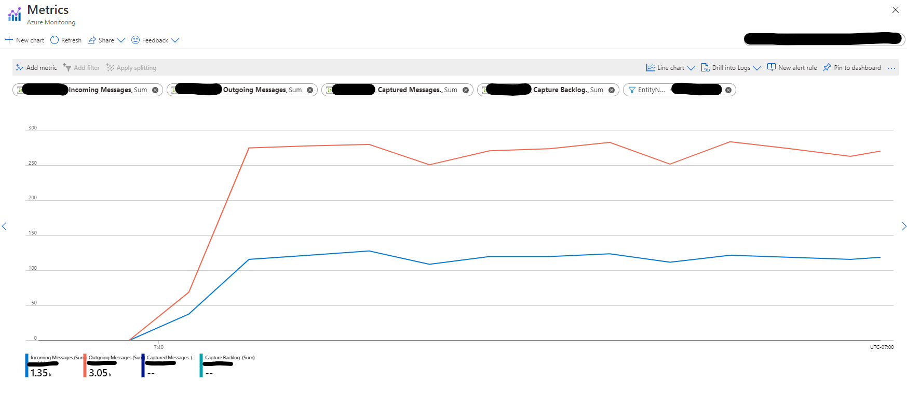
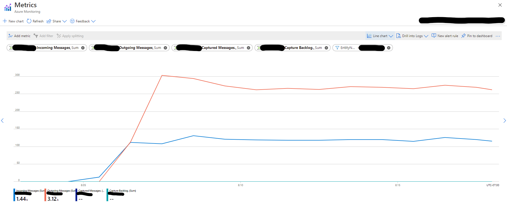
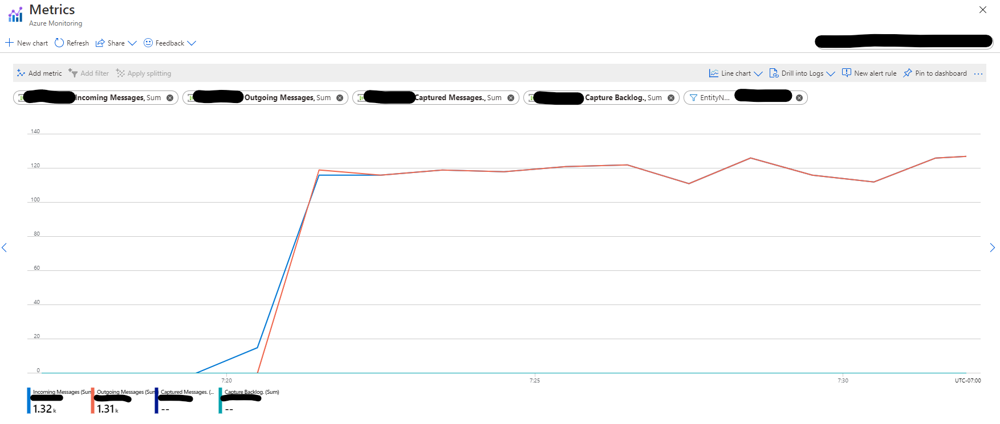

# How to Avoid the `ReceiverDisconnectedException`

In version 2.3.2 and above, the connector uses epoch receivers from the Event Hubs Java client.
This only allows one receiver to be open per consumer group-partition combo. To be crystal clear,
let's say we have `receiverA` with an epoch of `0` which is open within the consumer group `foo` on partition `0`.
Now, if we open a new receiver, `receiverB`, for the same consumer group and partition with an epoch of
`0` (or higher), then `receiverA` will be disconnected and get the `ReceiverDisconnectedException`. 

In order to avoid this issue, there should be only one reader per consumer group-partition combo.
In general, you should have a unique consumer group for each consuming application being run. 
Moreover, you should make sure that your code has been written in a way that does not result in 
re-computing the input stream from the eventhub.

In this document, we elaborate more on cases that result in recomputing the input stream unintentionally, 
and how you can avoid such cases by simple adjustments in your code.


## Table of Contents
* [Stream Recomputation](#stream-recomputation)
  * [RDD Actions](#rdd-actions)
  * [Write to Multiple Data Sinks](#write-to-multiple-data-sinks)
* [Quick Check for Multiple Readers](#quick-check-for-multiuple-readers)
* [Examples of Having Multiple Readers Unintentionally](#examples-of-having-multiple-readers-uninttentially)
  * [Multiple Actions](#multiple-actions)
  * [Multiple Sinks](#multiple-sinks)
* [Persist Data to Prevent Recomputation](#persist-data-to-prevent-recomputation)


## Stream Recomputation

Sometimes a Spark application recomputes a single input stream multiple times. If the input stream is an Event Hubs instance, 
this recomputation can eventually cause opening multiple receivers per consumer group-partition combo and result in getting 
the `ReceiverDisconnectedException`. Therefore, it is important to make sure that the application that reads 
events from an Event Hubs instance does not recompute the input stream multiple times.


### RDD Actions

In Spark, RDD operations are either `Transformations` or `Actions`. In abstract, transfromations create a new dataset 
and actions return a value. Spark has a `lazy` execution model for transfromations, which means those operations are 
being executed only when there is an action on the result dataset. Therefore, a transfomed RDD may be **recomputed**
each time an action is being ran on it. However, you can avoid this recomputation by persisting an RDD in memory using
the `persist` or `cache` method. Please refer 
to [RDD Operations](https://spark.apache.org/docs/latest/rdd-programming-guide.html#rdd-operations) for more details.   


### Write to Multiple Data Sinks

You can write the output of a streaming query to multiple sinks by simply using the DataFrame/Dataset multiple times.
However, each write may cause the recomputation of the DataFrame/Dataset. In order to avoid this recomputation, similar
to the RDD case you can `persist` or `cache` the DataFrame/Dataset before writing it to multiple locations. Please refer to 
[Using Foreach and ForeachBatch](https://spark.apache.org/docs/latest/structured-streaming-programming-guide.html#using-foreach-and-foreachbatch) 
for more information.


## Quick Check for Multiple Readers

A quick way to check if your application uses multiple readers is to compare the rate of `Incoming` and `Outgoing` messages to/from 
the underlying Event Hubs instance. You have access to both `Messages` and `Throughput` metrics in the Overview page of 
the Event Hubs instance on Azure Portal. 

Assume you have only Spark application (with a single stream reader) that reads events from an Event Hubs instance. 
In this case, you should see the number(or total bytes) of Outgoing messages matching the number (or total bytes) of
Incoming messages. If you find out the rate of Outgoing messages is `N` times the rate of Incoming messages, 
it indicates that your application is recomputing the input stream `N` times. This is a strong signal to 
update the application code to eliminate input stream recomputations (usually by using `persist` or `cache` method).


## Examples of Having Multiple Readers Unintentionally

### Multiple Actions

The code below is an example where a single read stream is being used by multiple RDD actions without caching:

```scala
import org.apache.spark.eventhubs._
import org.apache.spark.sql.DataFrame
import org.apache.spark.sql.streaming.Trigger

// EventHub connection string
val endpoint = "Endpoint=sb://SAMPLE;SharedAccessKeyName=KEY_NAME;SharedAccessKey=KEY;"
val eventHub = "EVENTHUBS_NAME"
val consumerGroup = "CONSUMER_GROUP"
val connectionString = ConnectionStringBuilder(endpoint)
  .setEventHubName(eventHub)
  .build

// Eventhub configuration
val ehConf = EventHubsConf(connectionString)
  .setStartingPosition(EventPosition.fromEndOfStream)
  .setConsumerGroup(consumerGroup)
  .setMaxEventsPerTrigger(500)

// read stream
val ehStream = spark.readStream
  .format("eventhubs")
  .options(ehConf.toMap)
  .load

ehStream.writeStream
  .trigger(Trigger.ProcessingTime("5 seconds"))
  .foreachBatch { (ehStreamDF,_) => 
      handleEhDataFrame(ehStreamDF)
  }
  .start
  .awaitTermination


def handleEhDataFrame(ehStreamDF : DataFrame) : Unit = {
  val totalSize = ehStreamDF.map(s => s.length).reduce((a, b) => a + b)
  val eventCount = ehStreamDF.count
  println("Batch contained " + eventCount + " events with total size of " + totalSize)
}
```

As you can see in the graph below which shows the rate of Incoming vs Outgoing messages in the 
Event Hubs entity, the number of Outgoing messages is almost twice the number of Incoming messages.
This pattern indicates that the above code reads events from the Event Hubs entity twice: Once when 
it computes the `reduce` action, and once when it computes the `count` action.




### Multiple Sinks

The code below shows how writing the output of a streaming query to multiple sinks creates multiple readers:

```scala
import org.apache.spark.eventhubs._
import org.apache.spark.sql.DataFrame
import org.apache.spark.sql.streaming.Trigger

// EventHub connection string
val endpoint = "Endpoint=sb://SAMPLE;SharedAccessKeyName=KEY_NAME;SharedAccessKey=KEY;"
val src_eventHub = "SRC_EVENTHUBS_NAME"
val dst_eventHub = "DST_EVENTHUBS_NAME"
val consumerGroup = "CONSUMER_GROUP"
val src_connectionString = ConnectionStringBuilder(endpoint)
  .setEventHubName(src_eventHub)
  .build
val dst_connectionString = ConnectionStringBuilder(endpoint)
  .setEventHubName(dst_eventHub)
  .build

// Eventhub configuration
val src_ehConf = EventHubsConf(src_connectionString)
  .setStartingPosition(EventPosition.fromEndOfStream)
  .setConsumerGroup(consumerGroup)
  .setMaxEventsPerTrigger(500)
val dst_ehConf = EventHubsConf(dst_connectionString)

// read stream
val ehStream = spark.readStream
  .format("eventhubs")
  .options(src_ehConf.toMap)
  .load
  .select($"body" cast "string")
  
// eventhub write stream
val wst1 = ehStream.writeStream
  .format("org.apache.spark.sql.eventhubs.EventHubsSourceProvider")
  .options(dst_ehConf.toMap)
  .option("checkpointLocation", "/checkpointDir") 
  .trigger(Trigger.ProcessingTime("10 seconds"))
  .start()

// console write stream
val wst2 = ehStream.writeStream
  .outputMode("append")
  .format("console")
  .option("truncate", false)
  .option("numRows",10)
  .trigger(Trigger.ProcessingTime("10 seconds"))
  .start()

wst1.awaitTermination()
wst2.awaitTermination()
```

You can see in the graph below from the source Event Hubs entity that the number of Outgoing messages is almost 
twice the number of Incoming messages which indicates the existence of two separate readers in our application.




### Persist Data to Prevent Recomputation

As we have mentioned before, one way to avoid recomputations is to persist (or cache) the generated
DataFrame/Dataset from the input stream before performing your desired tasks and unpersist it afterward.
The code below shows how you can run multiple actions on a DataFrame without recomputing the input stream:

```scala
import org.apache.spark.eventhubs._
import org.apache.spark.sql.DataFrame
import org.apache.spark.sql.streaming.Trigger

// EventHub connection string
val endpoint = "Endpoint=sb://SAMPLE;SharedAccessKeyName=KEY_NAME;SharedAccessKey=KEY;"
val eventHub = "EVENTHUBS_NAME"
val consumerGroup = "CONSUMER_GROUP"
val connectionString = ConnectionStringBuilder(endpoint)
  .setEventHubName(eventHub)
  .build

// Eventhub configuration
val ehConf = EventHubsConf(connectionString)
  .setStartingPosition(EventPosition.fromEndOfStream)
  .setConsumerGroup(consumerGroup)
  .setMaxEventsPerTrigger(500)

// read stream
val ehStream = spark.readStream
  .format("eventhubs")
  .options(ehConf.toMap)
  .load

ehStream.writeStream
  .trigger(Trigger.ProcessingTime("5 seconds"))
  .foreachBatch { (ehStreamDF,_) => 
      handleEhDataFrame(ehStreamDF)
  }
  .start
  .awaitTermination


def handleEhDataFrame(ehStreamDF : DataFrame) : Unit = {
  ehStreamDF.persist
  val totalSize = ehStreamDF.map(s => s.length).reduce((a, b) => a + b)
  val eventCount = ehStreamDF.count
  println("Batch contained " + eventCount + " events with total size of " + totalSize)
  ehStreamDF.persist
}
```

The graph below from the Event Hubs entity shows the number of Incoming and Outgoing messages are 
almost the same, which means the application reads events only once despite executing two actions 
on the generated DataFrame.

